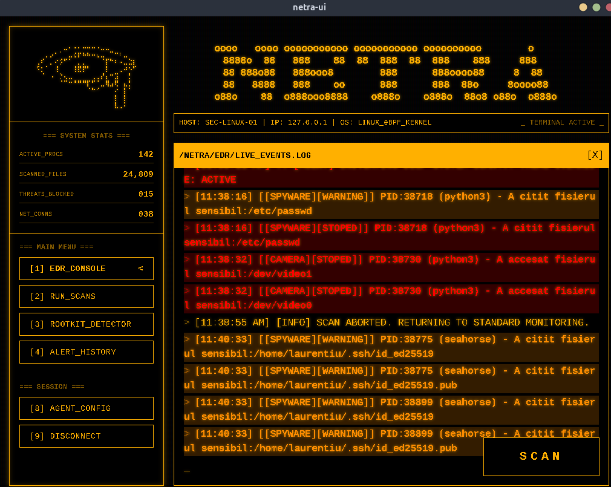

# NETRA — EDR/NDR bazat pe eBPF cu UI integrat în Go (Wails)



## Descriere generală

NETRA este un sistem de detecție și răspuns la nivel de endpoint (EDR — *Endpoint Detection and Response*), cu capabilități de detecție la nivel de rețea (NDR — *Network Detection and Response*). Sistemul folosește **eBPF** pentru colectarea de evenimente direct din kernel-ul Linux (creare de procese, operații pe fișiere, conexiuni de rețea), un modul de **corelare și decizie în user-space rescris complet în Go**, un mecanism de **răspuns automat** (izolare de proces/carantină), și o **interfață grafică desktop** construită în Go, cu ajutorul framework-ului **Wails** și **React**.

Proiectul este dezvoltat ca parte a lucrării de licență, cu scopul de a demonstra o arhitectură completă de detecție a comportamentului malițios — de la colectarea datelor la nivel de kernel, până la reacția automată și vizualizarea în timp real pentru utilizator.

---

## Arhitectură (Noua versiune Go-Userspace)

Sistemul a trecut printr-un refactoring major (de la un monolit în C pentru userspace, la o arhitectură modulară bazată pe Go). Motorul eBPF este acum compilat cu `bpf2go` și integrat direct în aplicația desktop Wails.

```text
┌─────────────────────────────────────────────────────────────┐
│                         KERNEL SPACE                        │
│                                                             │
│   edr.bpf.c              filer.bpf.c     network.bpf.c      │
│   (procese)              (fisiere)       (retea)            │
│         │                       │               │           │
│         └──────────┬────────────┴───────────────┘           │
│                     │  (BPF ring buffers)                   │
└─────────────────────┼───────────────────────────────────────┘
                       │
┌─────────────────────┼───────────────────────────────────────┐
│              USER SPACE (Go + Wails UI)                     │
│                     │                                       │
│          pkg/agent (bpf2go / cilium/ebpf)                   │
│          Incarcare si atasare programe BPF                  │
│                     │                                       │
│          pkg/detector (Reguli de detectie)                  │
│          - Ransomware (Scrieri multiple)                    │
│          - Spyware (Fisiere sensibile + Exfiltrare)         │
│          - HardwareBlock (Protectie Camera/Microfon/Difuzor)│
│                     │                                       │
│          pkg/events (runtime.EventsEmit)                    │
│                     │                                       │
│              React Frontend (App.jsx)                       │
│              Interfata grafica real-time                    │
└─────────────────────────────────────────────────────────────┘
```

---

## Componente și Funcționalități

### 1. Detecție Ransomware
- Monitorizează scrierile masive de fișiere (`sys_enter_openat`) folosind `filer.bpf.c`.
- Corelează evenimentele într-o fereastră de timp strictă.
- Carantinează procesul (`SIGSTOP`) dacă pragul de fișiere modificate este depășit.

### 2. Detecție Spyware
- Monitorizează accesul la fișiere considerate sensibile (ex: `/etc/passwd`, `/root/`, config-uri SSH).
- Corelează accesul sensibil cu deschiderea de conexiuni de rețea (`sys_enter_connect`, `sys_enter_sendto`) către adrese IP externe (`network.bpf.c`).
- Oprește procesul înainte ca exfiltrarea de date să se finalizeze.

### 3. Protecție Hardware (HardwareBlockDetector)
- Blochează și alertează în timp real încercările de acces neautorizat la periferice:
  - **Camera Web:** `/dev/video*`, `/dev/media*`
  - **Microfon:** `/dev/snd/pcm*c`
  - **Difuzor:** `/dev/snd/pcm*p`

### 4. Interfața Grafică (UI)
- Construită cu **Wails v2** (backend Go) și **React + TailwindCSS** (frontend).
- Rulează ca o aplicație desktop nativă pe Linux.
- Motorul eBPF este pornit automat într-un goroutine în fundal la lansarea aplicației, permițând ca evenimentele și alertele să ajungă instantaneu și reactiv pe dashboard-ul utilizatorului.

---

## Structura proiectului

```
NETRA/
├── kernel/                # Codul sursa C pentru eBPF
│   ├── edr.bpf.c          
│   ├── filer.bpf.c        
│   └── network.bpf.c      
├── NewVersion/            # Modulul de EDR (Go Userspace)
│   ├── pkg/
│   │   ├── agent/         # Entrypoint eBPF, fisiere generate (bpf2go)
│   │   ├── detector/      # Logica de business pentru detectie
│   │   ├── events/        # Trimitere de alerte catre Wails UI
│   │   ├── response/      # Izolare procese, carantina
│   │   └── store/         # State management procese
│   └── main.go            # Entrypoint standalone (optional)
├── UI/
│   └── netra-ui/          # Interfata grafica (Wails)
│       ├── app.go         # Leaga UI-ul de backend-ul eBPF
│       ├── frontend/      # React + Tailwind (App.jsx, index.css)
│       └── go.mod         # Importa direct NewVersion
├── Tests/                 # Scripturi Python pentru simulare malware
├── OldVersion/            # Versiunea veche, monolita, bazata exclusiv pe C
├── Images/                # Resurse media pentru documentatie
└── DEVELOPMENT_HISTORY.md # Jurnal arhitectural detaliat
```

---

## Compilare și rulare

### Cerințe de sistem
- Linux cu suport eBPF (kernel ≥ 5.8 recomandat).
- `clang`, `llvm`, `libbpf-dev` pentru compilarea BPF.
- `Go` ≥ 1.25.
- Wails v2: npm/Node.js, biblioteci native (ex: `libgtk-3-dev`, `libwebkit2gtk-4.1-dev`).

### Rularea aplicației complete (cu UI)
Pentru a porni EDR-ul integrat direct în interfața grafică:
```bash
cd UI/netra-ui
sudo wails dev
```
*(Notă: `sudo` este necesar deoarece atașarea programelor eBPF necesită privilegii de administrator).*

Pentru a rula scripturile de testare și a vedea cum apar alertele în interfață:
```bash
sudo python3 Tests/spywareTest.py
```

### Detalii arhitecturale și istoricul problemelor
Puteți consulta documentul de lucru `DEVELOPMENT_HISTORY.md` pentru detalii aprofundate legate de dificultățile întâmpinate, motivul refactorizării din C în Go, fix-uri de pointeri, memory leaks și problema integrării semnalelor între Wails și EDR.
